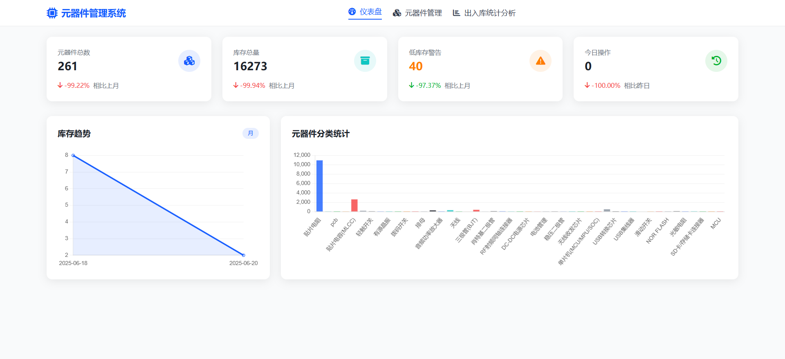
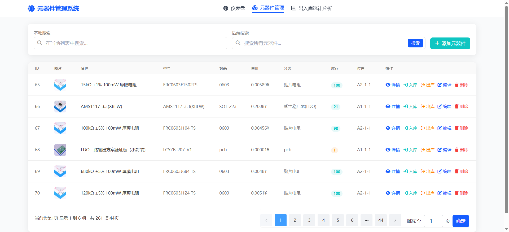
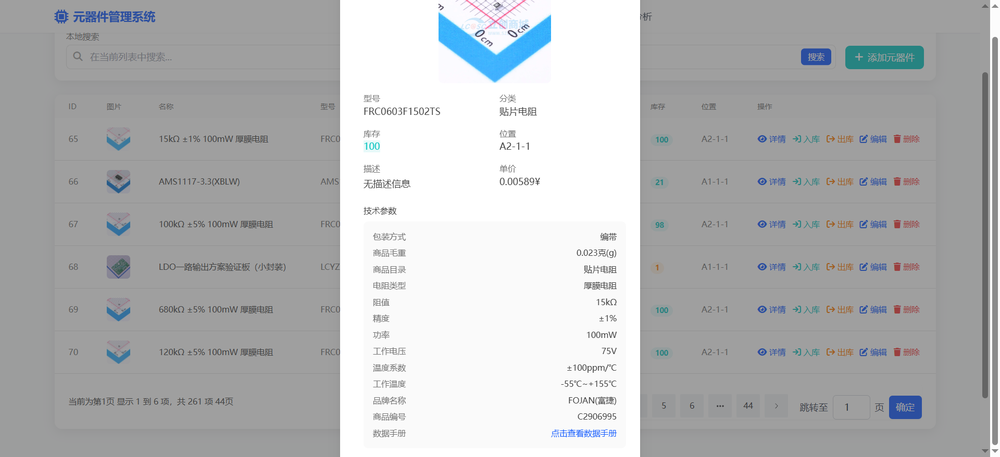

## 元器件管理器
> 未经许可禁止商用
- 1.这是一个简单的前后端分离式元器件管理器
- 2.可使用本地数据进行存储
- 3.不建议部署在服务器
- 4.建议只在本地pc上部署不适合多人协同，因为没有做权限管理


## 部署教程
## docker版本
- 支持docker部署
- 分为开发版本和生产环境版本，区别在于生产环境能应对更艰巨的请求和处理，开发版本有在于体积小，功能一致，后缀为* -slim-bookworm *为开发版本
- [百度网盘](https://pan.baidu.com/s/1tlUWyn5UERDjW748BaO_5A?pwd=u9fh)和[联想网盘(速度会快一点)](https://lecloud.lenovo.com/share/9RNsX7BmH6bGQvfU)
### 导入和启动
- docker导入
  ```
  docker load -i [filename].tar
  ```
- 启动
  ```
  docker run -d -p 8080:80 [imagename]
  ```

## 源码安装
### 1.安装依赖
> 本项目由django编写，使用restframework接口

- 可使用pip install进行单独安装，也可将本项目克隆到本地后使用pip install -r requirements.txt进行依赖的安装
```
Django
django-cors-headers
djangorestframework
```

### 2.数据库的初始化
> 不管是使用自带的数据库还是使用mysql等数据库都需要进行初始化

```
py .\manage.py makemigrations
py .\manage.py migrate
```

#### 2.1不使用自带的数据库
> 不使用自带的数据库需要更改*ElctronicComponents*目录下的*settings.py*文件的内容
- 默认配置
```
DATABASES = {
    'default': {
        'ENGINE': 'django.db.backends.sqlite3',
        'NAME': BASE_DIR / 'db.sqlite3',
    }
}
```
- mysql配置
```python
DATABASES = {
    'default': {
    'ENGINE': 'django.db.backends.mysql',
    'NAME':'elctroniccomponents', #数据库名字
    'USER': 'root',    #访问该数据库的用户
    'PASSWORD': 'password',#访问该数据库用户的密码
    'HOST': '127.0.0.1',
    'PORT': '3306',
    }
}
```
#### 2.1.1使用mysql还需要给*ElctronicComponents*目录下的 *\__init\__.py* 文件
- 添加如下内容
```
import pymysql

# 替换django默认底层mysql
pymysql.install_as_MySQLdb()
```
> 同时还需要pip install pymysql 安装mysql依赖，因为django官方使用的mysql引擎为mysqlclient 部分机器可能无法正确安装，因此使用mysql官方提供的pymysql引擎进行替换

### 3.现在已经万事俱备可以开启服务
```
py .\manage.py runserver 0.0.0.0:80
```
> 不可修改为其他端口，不可使用ipv6

> 现在浏览器访问 http://127.0.0.1/ 即可

### 4.*元器件后端.ps1*为windows快速启动服务并跳转浏览器的简易小脚本

### 5.展示图
- 主页

- 元器件列表页

- 详情页

